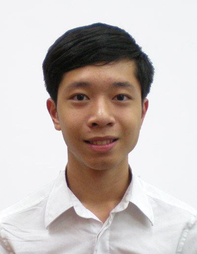
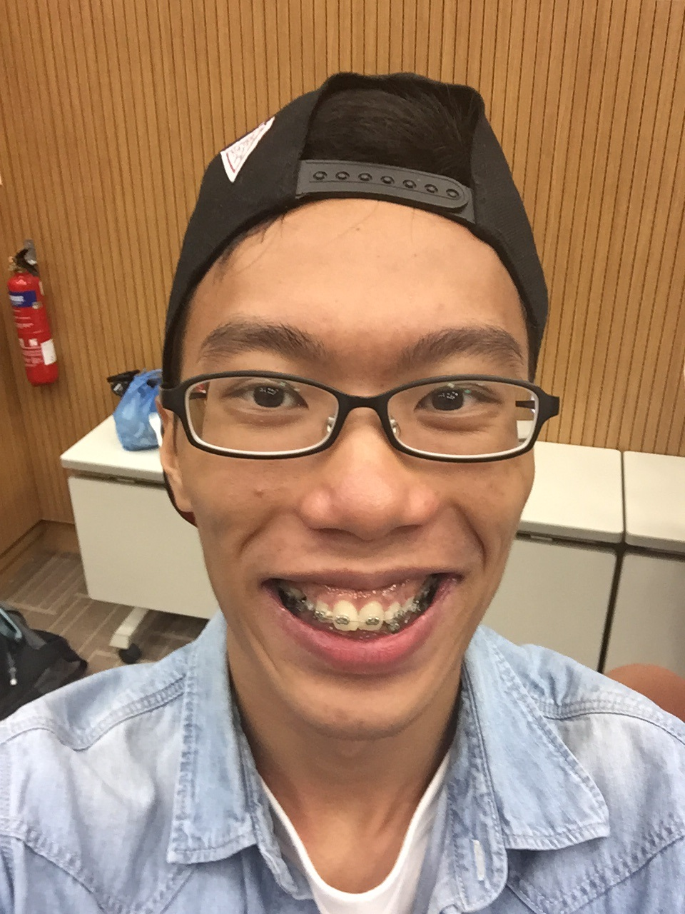
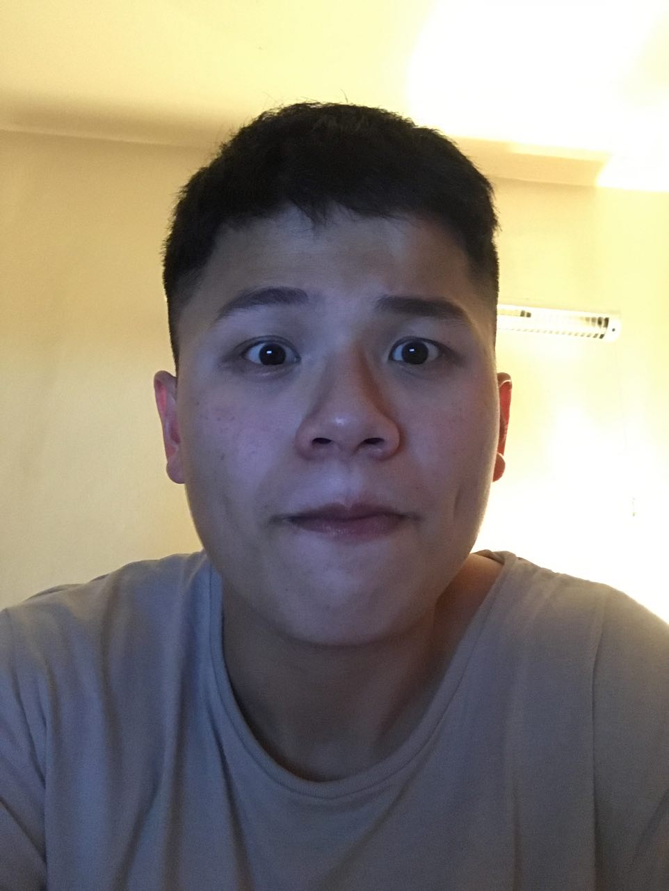

# About Us

We are a team based in the [School of Computing, National University of Singapore](http://www.comp.nus.edu.sg).

## Project Team

#### [Le Minh Phuc](http://github.com/le-minhphuc)  
 
Role: Team Leader, Developer  
Responsibilities: Scheduling and Tracking, Code Quality, Testing, Integration.  
Components: Logic, Model, Google Integration.

-----

#### [Gng Jia Hui](http://github.com/gngster)
 
Role: Developer  
Responsibilities: Testing.  
Components: UI, Logic.

-----

#### [Shao Hui](http://github.com/shinlos)
 
Role: Developer  
Responsibilities: Code Quality, Deliverables and Deadlines.  
Components: Logic, Model, Storage.

-----

#### [Low Tian Wei](http://github.com/tianweiweizx)
 
Role: Developer  
Responsibilities: Documentation  
Components: Documentations, Testing.

 -----

# Contributors

We welcome contributions. See [Contact Us](ContactUs.md) page for more info.
