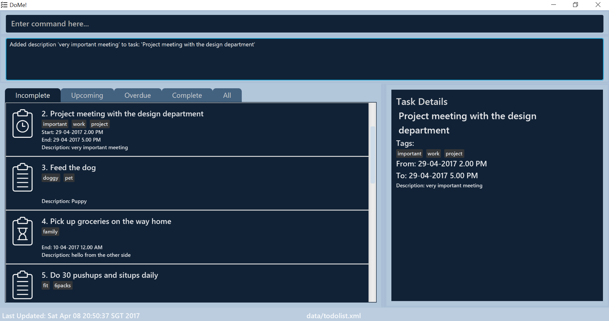

# DoMe! User Guide

By : `Team CS2103-W15-B1`  &nbsp;&nbsp;&nbsp;&nbsp; Since: `Jan 2017`  &nbsp;&nbsp;&nbsp;&nbsp; Licence: `MIT` &nbsp;&nbsp;&nbsp;&nbsp; GithubLink: `https://github.com/CS2103JAN2017-W15-B1/main/blob/master/docs/UserGuide.md`

---

1. [Introduction](#1-introduction)
2. [Quick Start](#2-quick-start)
3. [Features](#3-features)
4. [FAQ](#4-faq)
5. [Command Summary](#5-command-summary)
6. [Appendix](#6-appendix)

## 1. Introduction

Ever felt overwhelmed by the multitude of tasks you have to complete and have no idea where to start? Are you looking for an easy to work with application to help you track all your activities? Well, look no further! Your very own task manager - *DoMe!* is here to assist you!
*DoMe!* is your personal assistant that tracks all your activities and displays them in an easy-to-read display. It saves you the hassle of remembering what needs to be done and helps you prioritise your tasks.
Unlike other software, *DoMe!* is simple and intuitive. All you need is your keyboard to type in a single line of command, removing the inconvenience of clicking and navigating through blundersome menus. Let's get started in being productive and organised with *DoMe!*

## 2. Quick Start

1. Ensure you have Java version `1.8.0_60` or later installed in your Computer. 
> Please note that the app is incompatible with earlier versions of Java 8.
2. Download the latest `taskmanager.jar` from the [releases](../../../releases) tab.
3. Copy the file to the folder you want to use as the home folder for your Address Book.
4. Double-click the file to start the app. The GUI should appear in a few seconds.
> 

## 3. Features

> **Command Format**
> 
> * Items in `Square brackets [ ]` denote a required field.
> * Iteams in `Curved brackets ( )` denote an optional field.
> * `...` denotes that you can have multiple instances.
> * The `[Task-Number]` refers to the index number shown in the task listing that is currently on the screen. 
    The `[Task-Number]` **must be a positive integer** 1, 2, 3, ...

### 3.1 Functional features
This is a list of commands you can give to the application

#### 3.1.1 View help: `help`
If you are unsure of the command formats, you can simply type `help` and view all the available commands and how to use them.

_Format:_
`help`

#### 3.1.2 Add task: `add`
It's time to start adding tasks to your todo list! You can add events (tasks with a start time and an end time), kick-start tasks (task with only a start time), deadline tasks (tasks with a date line) and also just tasks with names. You can also organize these tasks using tags.

_Format:_
`add [Name-of-Task] (s/Start-Time) (e/End-Time) (t/Tag-1) (t/Tag-2)`

> Name of task can only contains alphanumeric characters and '. 
> Start/End Time can either be in format DD-MM-YYYY H.MM AM/PM  or simply DD-MM-YYYY. 
> For example: 12-08-2016 4.00 PM or simply 12-08-2016. 
> A task can have any number of tags (including 0). 

_Example:_

* `add date with girlfriend s/07-04-2017 6.00 PM e/07-04-2017 10.00 PM t/mylady` 
  If you're on a tight schedule, you can add a task with a specific start time and a specific end time, along with a 
  tag to feel organized.

* `add Reply Boss's email s/13-04-2017 10.00 AM e/13-04-2017 10.00 PM t/Work t/Urgent t/HighPriority` 
  You can also be more organized by adding more tags - this will make finding the task easier as you will see when  
  you reach the `find` command.
  
* `add Start preparing for conference s/15-06-2017 t/Work t/Conference` 
  If you are not sure about the end time or want to be flexible with it, you can choose not to specify the end time.  

* `add Help John with Excel before his report due e/20-04-2017 t/Work t/Colleague` 
  And the same goes for the start time.
  
* `add Daily email check` 
  You can also do away with the time and the tags for your daily habits.

#### 3.1.3 Edit task: `edit`
You can update the details of your task by editing it. In particular, you can organize your tasks by adding/removing their tags, changing starting and ending time or changing the task's name.
> Add tags to the task at the specified index. The index refers to the index number shown in the last person listing.

_Format:_
`edit [Task-Number] (Name-Of-Task) (s/Start-Time) (e/End-Time)[t/Tag-1] [t/Tag-2] ...`

> * Edits the task at the specified `[Task-Number]`.
> * **At least one** of the optional fields must be provided.
> * Existing values will be updated to the input values.
> * When editing tags, the existing tags of the task will be removed i.e adding of tags is not cumulative.
> * You can remove all the task's tags by typing `t/` without specifying any tags after it. 

_Example:_
* `edit 1 t/urgent t/for mom` 
  All tags of the task with index `1` on the current list will be removed and replace with `[urgent]` and `[for mom]`
  
* `edit 2 meet my mother s/07-04-2017 7.00 PM e/07-04-2017 10.00 PM t/mother` 
  Change the name of the task with index `2` on the current list to `meet my mother`, the start time to
  `07-04-2017 7.00 PM`, the end time to `07-04-2017 10.00 PM`, and replace all the tags with `[mother]`.

#### 3.1.4 Describe task: `describe`
You can add in a task description for a specific task and the description will be reflected in the task details.

_Format:_
`describe 1 [desired description]`

_Example:_
* `describe 1 this determines my promotion` 
  Reminds yourself that the task with index `1` on the current list will determine your promotion and thus should be 
  attend to immediately.

#### 3.1.5 Complete task: `complete`
You can mark a task as completed to check it off your list of incomplete tasks.

_Format:_
`complete [Task-Number]`

_Example:_
* `complete 2` 
  Check off the task with index number `2` on your incomplete list to avoid mixing up tasks that you've done and tasks
  that you've not done. 

#### 3.1.6 Delete task: `delete`
If you no longer need to do a task, you can simply delete it from your to-do list. However, if you mistakenly delete something, you can retrieve it back using the `undo` command that is explained further down the guide.

_Format:_
`delete [Task-Number]`

_Example:_
* `delete 2` 
  Remove the task with index number `2` for good and never see it again! Maybe your meeting was cancelled, or adding the
  task is simply a mistake.

#### 3.1.7 List: `list`
You can view a specific type of the tasks you want to view in your to-do list.

_Format:_
`list all`
> Lists all tasks that are currently in your to-do list.

`list complete`
> Lists tasks marked as completed.

`list incomplete`
> Lists tasks marked as incomplete.

`list upcoming`
> Lists all upcoming tasks.

`list overdue`
> Lists incomplete tasks with deadlines that have already passed.

#### 3.1.8 Find: `find`
You can find a task to by simply searching for tasks with matching keywords in their names and/or tags

> The search is case insensitive.

_Format:_
`find (name) (t/Tag1) (t/Tag2) ...`

_Example:_
* `find report` 
  Returns a list of tasks (if any) with the phrase `report` in its name or tag.

#### 3.1.9 Undo previous command: `undo`

You can easily undo your last command given

> This will undo the most previous command that mutated the data such as add, edit & delete.

_Format:_
`undo`

_Example:_
`undo`
Returns the undoing of the previous command that mutated the data, e.g. Undone: add send TPS report to Bill by Friday 6pm.

#### 3.1.10 Redo previous command: `redo`

You can easily redo your last command undone

> This will redo the most previous command that was undone.

_Format:_
`redo`

_Example:_
`redo`
Redoes the previous command that mutated the data, e.g. Redone: add send TPS report to Bill by Friday 6pm.

#### 3.1.11 Select a task: `select`
You can select a task to view more details about it

_Format:_
`select [Task-Number]`

_Example:_
`select 1`

#### 3.1.12 Google Integration: `sync`
You can sync your current to-do list to your Google Calendar.

_Format:_
`sync`
The current data in the to-do list has been synced to the Google Calendar

#### 3.1.13 Clear the data : `clear`
You can clear your entire to-do list

_Format:_
`clear`

#### 3.1.14 Customize file storing: `changestorage`
You can change the storage location of the data to transfer your current todo list to your own storage system with ease
> Store all the data of the task manager in the file located at PATH_TO_STORAGE_FILE. It is required that this file be a .txt file located in StorageFile/a folder rooted at StorageFile, and that it is created before the command is called.

_Format:_
`changestorage PATH_TO_STORAGE_FILE`

Examples:
* `changestorage StorageFile/StoreHereInstead/MyStorage.txt` 
  The task manager will store its data in MyStorage.txt located at StorageFile/StoreHereInstead/MyStorage.txt, provided that this file exists before calling the command.

* `changestorage StorageFile/AnotherStorage.txt`
  The task manager will store its data in AnotherStorage.txt located under StorageFile instead of the default storage location, provided that this file exists before calling the command.
  
* `changestorage YourThumbDrive` 
  Upon the invocation of this command, DoMe! will automatically creates a storage file called `todolist.xml` in `YourThumbDrive` folder and store data there instead! What an easy way to bring your To-do List with you home!

#### 3.1.15 Copy data to new storage location: `exportsave`
You can copy the data in the current to-do list to your own storage system with ease.
> Store all the data of the task manager in the file located at PATH_TO_STORAGE_FILE. It is required that this file be a .txt file located in StorageFile/a folder rooted at StorageFile, and that it is created before the command is called.

_Format:_
`exportsave PATH_TO_STORAGE_FILE`

Examples:
* `exportsave StorageFile/StoreHereInstead/MyStorage.txt` 
  The task manager will copy its data in MyStorage.txt located at StorageFile/StoreHereInstead/MyStorage.txt, provided that this file exists before calling the command.

* `exportsave YourThumbDrive` 
  Upon invocation of this command, DoMe! will copy your entire To-do List to `todolist.xml` in `YourThumbDrive` folder, allowing you to make a backup of all your data while still storing in the default location.

## 4. FAQ

* **Q**: How do I transfer my data to another computer? 
* **A**: Copy the app to the other computer and overwrite the empty data file it creates with the file that contains the data of your previous *DoMe!* folder.

* **Q**: I cannot access the Help document. 
* **A**: Check your internet access. Internet connection is required to access the help document.

## 5. Command Summary

* **Help** : `help` 

* **Add** : `add [Name-of-Task] (s/Start-Time) (e/End-Time) (t/Tag1) ...`
  
* **Edit** : `edit [Task-Number] [Edited-Details] (t/Edited-Tag)`

* **Delete** : `delete [Task-Number]`
   
* **Undo** : `undo`

* **Redo** : `redo`
   
* **Find** : `find [Keyword] (t/TagKeyword)...`

* **Describe** : `describe [Task-Number] (description)`

* **List** : `list all`, `list incomplete`, `list complete`, `list overdue`, `list upcoming`

* **Sync** : `sync`

* **Select** : `select [Task-Number]`

* **Clear** : `clear`

* **Changestorage** : `changestorage [PATH_TO_STORAGE_FILE]`

* **Exportsave** : `exportsave [PATH_TO_STORAGE_FILE]`

---
  
## 6. Appendix
  
  | Word | Definition |
|-----|-----|
|[GUI]|Graphic User Interface. The interface presented to users to interact with *DoMe!*.|
|[Storage Path]|This is the directory where your data will be saved.|
